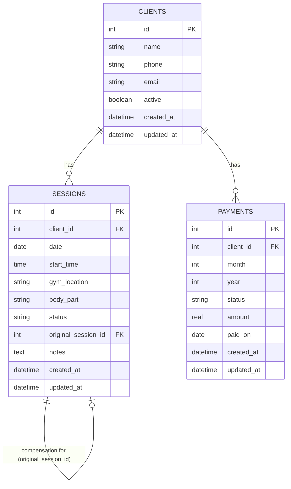

Gym Trainer Management System (IB CS IA)

A full-stack management web application built for personal trainers to manage clients, session schedules, cancellation/compensation workflows, and payment tracking.

## 🏗 Architecture Overview

- **Frontend:** Streamlit (UI with multi-page navigation)
- **Backend:** FastAPI (RESTful API, Pydantic validation, business rules)
- **Database:** SQLite (`gym_trainer.db`)
- **Data Access:** SQLAlchemy ORM / DDL SQL scripts

---

## 📁 Project Structure

```text
Gym-trainer-management-system-cs-ia/
├── frontend/
│   ├── app.py                 # Streamlit main entry point
│   ├── api_client.py          # API wrapper client for FastAPI endpoints
│   └── pages/
│       ├── dashboard.py       # Trainer dashboard & metrics
│       ├── clients.py         # Client management & profiles
│       ├── schedule.py        # Daily schedule & gym grouping
│       └── payments.py        # Payment status tracking
├── backend/
│   ├── main.py                # FastAPI app entry point & routes
│   ├── database.py            # Database connection & session setup
│   ├── api/                   # API routes (clients, sessions, payments, dashboard)
│   ├── schemas/               # Pydantic request/response schemas
│   ├── models/                # SQLAlchemy database models
│   ├── services/               # Business logic layer
│   └── repositories/          # Data access layer
├── database/
│   ├── schema.sql             # SQLite DDL creation script (Clients, Sessions, Payments)
│   ├── seed.sql               # Seed SQL script (20 clients, 77 sessions, 40 payments)
│   └── schema.md              # Database documentation & Mermaid ERD diagram
├── tests/                     # Automated test suites
├── data/
│   └── seed.py                # Python seed script
├── requirements.txt
├── README.md
└── .env.example
```

---

## 📊 Database Schema & ERD

The database contains 3 core tables with `created_at` and `updated_at` timestamp tracking:

- **`clients`**: Client personal & contact details (Active / Inactive flag).
- **`sessions`**: Gym workout sessions, locations, muscle groups, statuses (`scheduled`, `completed`, `cancelled`, `compensation`), and self-referencing `original_session_id` link for compensations.
- **`payments`**: Monthly client payment tracking (`paid`, `unpaid`, amounts, and payment dates).



---

## 🚀 Database Setup & Execution Commands

### 1. Initialize Tables & Seed Sample Data

```shell
# Create database tables
sqlite3 gym_trainer.db < database/schema.sql

# Insert sample seed records (20 clients, 77 sessions, 40 payments)
sqlite3 gym_trainer.db < database/seed.sql
```

### 2. Verify Database Records

```shell
# Check session status breakdown
sqlite3 gym_trainer.db "SELECT status, COUNT(*) FROM sessions GROUP BY status;"

# Check payment status breakdown
sqlite3 gym_trainer.db "SELECT status, COUNT(*) FROM payments GROUP BY status;"
```

---

## ✅ Completed Milestones

1. **Project Directory & File Structure Setup**: Created full modular directory structure (`frontend/`, `backend/`, `database/`, `tests/`, `data/`).
2. **Database DDL Schema**: Created `database/schema.sql` with `clients`, `sessions`, and `payments` tables including `created_at` and `updated_at` timestamps and foreign key constraints.
3. **Database Documentation**: Created `database/schema.md` with full Mermaid ERD diagram and field dictionaries.
4. **Seed Dataset**: Created `database/seed.sql` populating SQLite with 20 clients, 77 mixed session records (completed, cancelled, linked compensation, scheduled), and 40 payment records.
