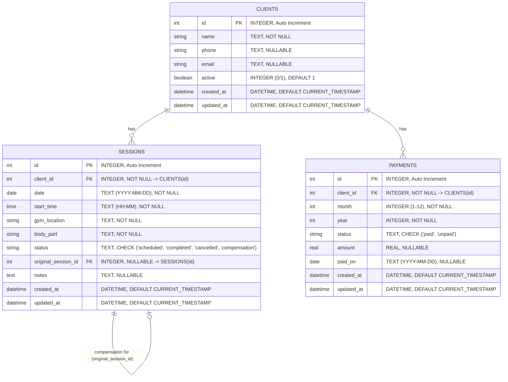

# Gym Trainer Management System - Database Schema & ERD

**Suggested Database Name:** `gym_trainer.db`
**Database Engine:** SQLite 3

---

## 1. Entity-Relationship Diagram (ERD)



---

## 2. Table Summary

### Table: `clients`

- Stores information for personal training clients.

| Field          | Type     | Constraint                | Purpose                                       |
| -------------- | -------- | ------------------------- | --------------------------------------------- |
| `id`         | INTEGER  | PRIMARY KEY AUTOINCREMENT | Unique client ID                              |
| `name`       | TEXT     | NOT NULL                  | Client's full name                            |
| `phone`      | TEXT     | NULLABLE                  | Contact phone number                          |
| `email`      | TEXT     | NULLABLE                  | Contact email address                         |
| `active`     | INTEGER  | DEFAULT 1                 | Active client flag (1 = Active, 0 = Inactive) |
| `created_at` | DATETIME | DEFAULT CURRENT_TIMESTAMP | Record creation timestamp                     |
| `updated_at` | DATETIME | DEFAULT CURRENT_TIMESTAMP | Record last update timestamp                  |

---

### Table: `sessions`

- Tracks workout sessions, locations, status, and compensation links.

| Field                   | Type     | Constraint                                            | Purpose                                          |
| ----------------------- | -------- | ----------------------------------------------------- | ------------------------------------------------ |
| `id`                  | INTEGER  | PRIMARY KEY AUTOINCREMENT                             | Unique session ID                                |
| `client_id`           | INTEGER  | FOREIGN KEY -> clients(id)                            | Client receiving the session                     |
| `date`                | TEXT     | NOT NULL (YYYY-MM-DD)                                 | Date of session                                  |
| `start_time`          | TEXT     | NOT NULL (HH:MM)                                      | Session start time                               |
| `gym_location`        | TEXT     | NOT NULL                                              | Gym venue / branch                               |
| `body_part`           | TEXT     | NOT NULL                                              | Focus muscle group / area                        |
| `status`              | TEXT     | CHECK (scheduled, completed, cancelled, compensation) | Current session state                            |
| `original_session_id` | INTEGER  | FOREIGN KEY -> sessions(id) NULLABLE                  | Links compensation to original cancelled session |
| `notes`               | TEXT     | NULLABLE                                              | Trainer notes                                    |
| `created_at`          | DATETIME | DEFAULT CURRENT_TIMESTAMP                             | Record creation timestamp                        |
| `updated_at`          | DATETIME | DEFAULT CURRENT_TIMESTAMP                             | Record last update timestamp                     |

---

### Table: `payments`

- Tracks monthly client payment status.

| Field          | Type     | Constraint                 | Purpose                        |
| -------------- | -------- | -------------------------- | ------------------------------ |
| `id`         | INTEGER  | PRIMARY KEY AUTOINCREMENT  | Unique payment record ID       |
| `client_id`  | INTEGER  | FOREIGN KEY -> clients(id) | Associated client              |
| `month`      | INTEGER  | CHECK (1..12)              | Payment month                  |
| `year`       | INTEGER  | NOT NULL                   | Payment year                   |
| `status`     | TEXT     | CHECK (paid, unpaid)       | Payment tracking status        |
| `amount`     | REAL     | NULLABLE                   | Payment amount                 |
| `paid_on`    | TEXT     | NULLABLE (YYYY-MM-DD)      | Date when payment was received |
| `created_at` | DATETIME | DEFAULT CURRENT_TIMESTAMP  | Record creation timestamp      |
| `updated_at` | DATETIME | DEFAULT CURRENT_TIMESTAMP  | Record last update timestamp   |

---

## 3. How to Execute in SQLite

You can run the DDL file directly using the SQLite CLI:

```bash
sqlite3 gym_trainer.db < database/schema.sql
```
